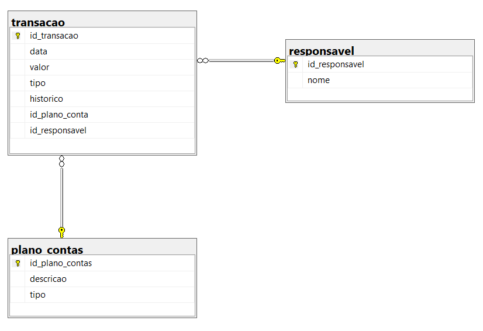

# My Finance Web
MyFinance - Projeto do Curso de Pós-Graduação em Engenharia de Software da PUC-MG
<br />
<br />

## 🖥️ Descrição do Projeto
Este projeto foi desenvolvido nas aulas práticas da disciplina de Práticas de Implementação e Evolução de Software e tem como objetivo oferecer uma ferramenta para gerenciamento de finanças pessoais. 

Como funcionalidade básica inicial, tem-se as seguintes:

- **Transações:** permite a criação, edição e exclusão de transações, sendo que cada transação é definida por um id único, data em que a transação foi efetuada, valor, tipo (crédito - C ou débito - D), histórico e plano de conta (relaciona ao plano de conta criado na outra funcionalidade).
*Exemplo de transação:* Compra de um cookie associado ao plano de conta "alimentação".

- **Plano de Contas:** permite a criação, edição e exclusão de um plano de contas. Um plano de contas possui id único, tipo (crédito - C ou débito - D) e descrição. 
*Exemplo de plano de contas:* Alimentação, Aluguel, etc.

<br />

## 📝 Modelagem Lógica do Banco de Dados
<br />

<br />
Figura 1 - Diagrama de Entidades e Relacionamentos

<br />

## 🛠️ Requisitos para Compilação do Projeto

Para realizar a execução deste projeto é necessário seguir os passos:

- Executar o arquivo *myfinance.sql* (ficheiro *docs*) no SQL Server.
- Clonar o repositório deste projeto. 
```
git clone https://github.com/nathaliarezende/myfinance-web-netcore.git
```
- Executar os seguintes comandos para buildar e rodar o projeto (no ficheiro *myfinance-web-netcore*): 
```
dotnet build
dotnet run
```